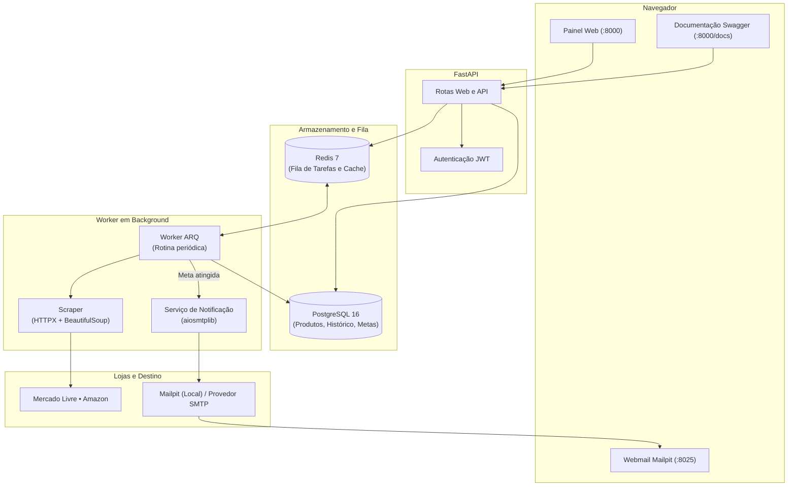

# Vigia — Monitor de Preços

[](https://www.python.org/)
[](https://fastapi.tiangolo.com/)
[](https://www.postgresql.org/)
[](https://redis.io/)
[](https://www.docker.com/)
[](https://opensource.org/licenses/MIT)

Aplicação web para acompanhar preços em lojas online (Mercado Livre, Amazon, entre outras), montar histórico de variações com gráficos e avisar por e-mail quando um produto atingir o preço desejado.

---

## Sobre o Projeto

O **Vigia** é uma plataforma desenvolvida para automatizar o acompanhamento de preços de produtos em e-commerces. Em vez de depender de extensões de navegador ou checagens manuais, a aplicação faz coletas autônomas em segundo plano, registra cada variação para gerar um histórico com gráficos e notifica o usuário por e-mail assim que o produto atinge o valor desejado.

Principais capacidades do sistema:

- **Coleta e monitoramento automático**: Um worker independente roda a cada 5 minutos consultando as páginas dos produtos cadastrados (Mercado Livre, Amazon, etc.) via requisições assíncronas, extraindo preço atualizado e status de disponibilidade em estoque sem travar a navegação do usuário.
- **Histórico cronológico e gráficos**: Cada alteração de preço é armazenada com data e hora. O painel web utiliza esses registros para traçar gráficos interativos de evolução, facilitando identificar se uma promoção é real ou se o preço subiu recentemente.
- **Metas de preço com política anti-spam**: O usuário estipula quanto quer pagar por cada item. Quando o valor cai para a meta ou abaixo dela, o sistema dispara um alerta. Para evitar sobrecarregar o usuário com mensagens repetidas a cada checagem, o alerta só é rearmado caso o preço volte a subir e caia novamente.
- **Notificações transacionais por e-mail**: Ao atingir a meta, é enviado um e-mail formatado (com suporte a HTML e texto puro) destacando o preço anterior, o novo preço com o valor economizado e o botão com link direto para a loja.
- **Ambiente de testes com Mailpit**: O projeto já vem com um servidor SMTP local embutido (Mailpit), permitindo visualizar os e-mails disparados em uma interface web própria (porta 8025), sem precisar cadastrar chaves de serviços externos durante o desenvolvimento.
- **Painel web com autenticação**: Interface limpa para cadastro de links, login seguro com tokens JWT, gerenciamento de metas e acompanhamento visual em tempo real dos produtos monitorados.


---

## Como o sistema funciona

O projeto separa as requisições web do trabalho pesado de scraping e envio de e-mails para manter a interface rápida:



---

## Tecnologias utilizadas

- **Linguagem e API**: Python 3.12, FastAPI, Uvicorn, Pydantic
- **Banco de Dados**: PostgreSQL 16, SQLAlchemy 2.0 (async), Alembic
- **Filas e Tarefas**: Redis 7, ARQ
- **Coleta de Preços**: HTTPX, BeautifulSoup4
- **E-mails**: aiosmtplib, Jinja2, Mailpit
- **Interface**: Jinja2, Tailwind CSS, Chart.js
- **Ambiente e Testes**: Docker, Docker Compose, uv, Pytest

---

## Como rodar o projeto

### Pré-requisitos
- [Docker](https://docs.docker.com/get-docker/) e [Docker Compose](https://docs.docker.com/compose/) instalados.

### 1. Clonar o repositório
```bash
git clone https://github.com/Francisco-Cassio/plataforma_monitoramento_de_precos.git
cd plataforma_monitoramento_de_precos
```

### 2. Configurar o ambiente
Copie o arquivo de exemplo:
```bash
cp .env.example .env
```
*(As variáveis já vêm configuradas para rodar no Docker local).*

### 3. Iniciar os containers
```bash
docker compose up -d --build
```

O comando inicia os 5 containers necessários:
- `price_monitor_api` (API e Painel Web)
- `price_monitor_worker` (Worker em segundo plano)
- `price_monitor_mailpit` (Capturador de e-mails para testes)
- `price_monitor_postgres` (Banco de dados)
- `price_monitor_redis` (Fila e cache)

### 4. Acessar no navegador
- **Painel Web**: [http://localhost:8000](http://localhost:8000)
- **Documentação da API (Swagger)**: [http://localhost:8000/docs](http://localhost:8000/docs)
- **Caixa de Entrada de Testes (Mailpit)**: [http://localhost:8025](http://localhost:8025)

---

## Popular dados de demonstração

Se quiser ver o painel já preenchido com produtos, histórico de preços e gráficos de teste:

```bash
# Cria um usuário de teste (demo@vigia.com / password123) com produtos e histórico
docker compose exec api python -m app.scripts.seed_demo --create-user

# Para limpar os dados de teste e recomeçar:
docker compose exec api python -m app.scripts.seed_demo --reset
```

---

## Rotas principais da API (`/api/v1`)

- **Autenticação (`/api/v1/auth`)**:
  - `POST /register` — Cadastro de usuário
  - `POST /login` — Login e geração de token JWT
  - `GET /me` — Dados do usuário atual
- **Produtos (`/api/v1/products`)**:
  - `GET /` — Lista produtos do usuário
  - `POST /` — Cadastra novo link para monitorar
  - `GET /{id}` — Detalhes e status de estoque
  - `GET /{id}/history` — Histórico de preços para montar gráficos
  - `DELETE /{id}` — Remove o produto
- **Metas (`/api/v1/alerts`)**:
  - `GET /` — Lista metas ativas
  - `POST /` — Define ou atualiza preço-alvo de um produto
  - `DELETE /{id}` — Remove meta de preço

---

## Testes automatizados

Para rodar os testes da aplicação:

```bash
docker compose exec api python -m pytest tests/test_notifications.py tests/test_services.py -v
```

---

## Estrutura do projeto

```text
plataforma_monitoramento_de_precos/
├── docker-compose.yml       # Configuração dos containers (App, Worker, BD, Redis, Mailpit)
├── Dockerfile               # Imagem da aplicação com Python 3.12 e uv
├── pyproject.toml           # Dependências e metadados
├── uv.lock                  # Versões travadas das dependências
├── README.md                # Documentação
├── LICENSE                  # Licença MIT
├── alembic/                 # Migrações do banco de dados
├── tests/                   # Testes unitários e de integração
└── src/
    └── app/
        ├── api/             # Rotas da API REST
        ├── core/            # Configurações, segurança e conexão com banco
        ├── models/          # Modelos de dados (User, Product, PriceHistory, PriceAlert)
        ├── repositories/    # Consultas ao banco de dados
        ├── scrapers/        # Lógica de extração de preços por loja
        ├── scripts/         # Script de dados de teste (seed)
        ├── services/        # Regras de negócio (notificações, scraping, auth)
        ├── templates/       # Telas HTML (dashboard e e-mail)
        ├── web/             # Rotas das páginas web do painel
        └── workers/         # Tarefas agendadas e configuração do ARQ
```

---

## Licença

Distribuído sob a licença [MIT](LICENSE).

---

Desenvolvido por **Francisco de Cássio** • [GitHub](https://github.com/Francisco-Cassio)
